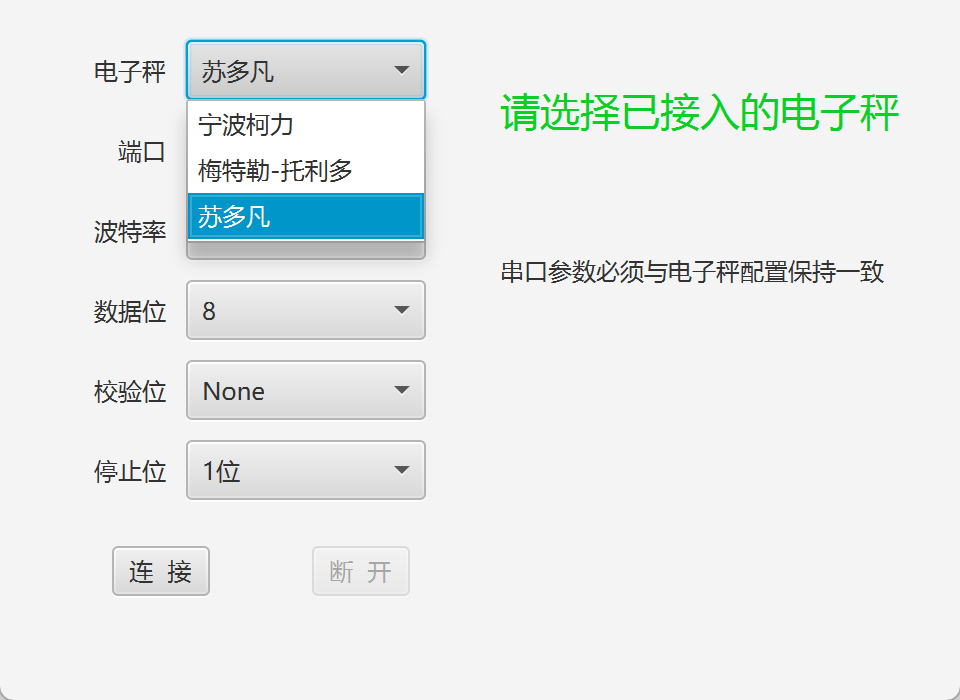
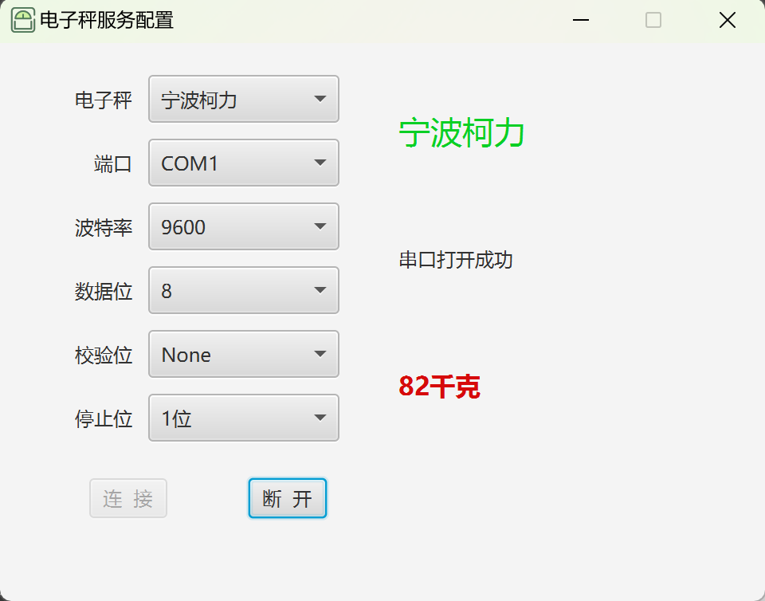
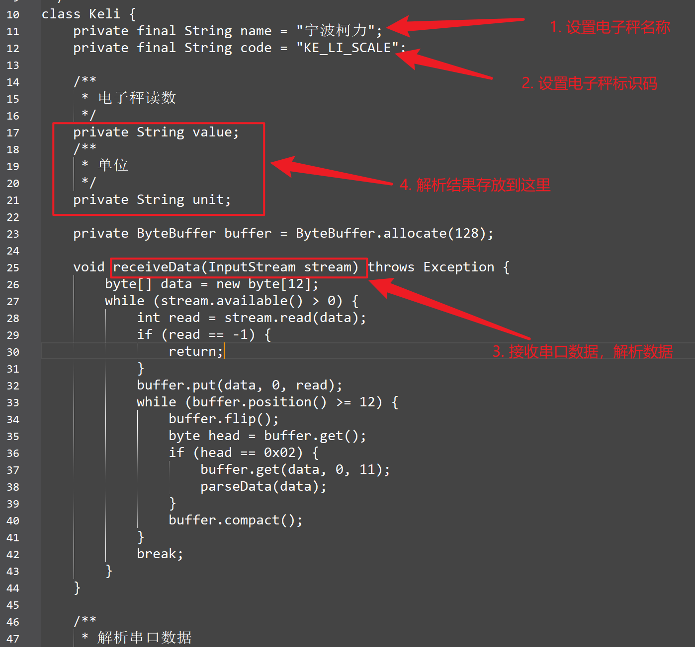

# electronic-scale
electronic-scale 是一个读取电子秤的小程序，它提供的websocket接口，可以方便的将电子秤与其它系统集成（如MES、WMS等）。
electronic-scale 适用于提供串口通信的电子秤，不同的电子秤协议可以根据实际情况编写协议解析脚本（groovy语言），无需更改程序可以直接使用。
# features
- 可视化配置，通过UI配置电子秤及串口通信参数
- 实时显示电子秤的称量结果
- 自动保存当前配置，启动时自动连接电子秤
- 添加windows 系统托盘，可隐藏UI
- 提供websocket接口便于集成，默认接口地址：/material/scale
- 提供RESTfull接口，默认接口地址：/material/weight
- 编译后生成msi程序，便于安装
- 默认提供：苏多凡、柯力、梅特勒--托利多电子秤协议转换脚本
# environment
 - jdk 1.8
 - JavaFx
 - springboot
 - groovy
# build 
1. 注意：dll 目录中的rxtxParallel.dll和rxtxSerial.dll两个库文件考到如下目录
JAVA_HOME\jre\bin
C:\Windows\System32

2. 编译命令：mvn jfx:native
3. groovy脚本文件目录： ./scales
# Screenshots

    

    

    
  
